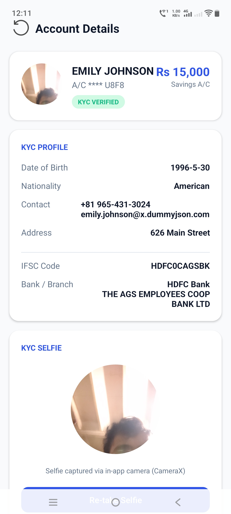
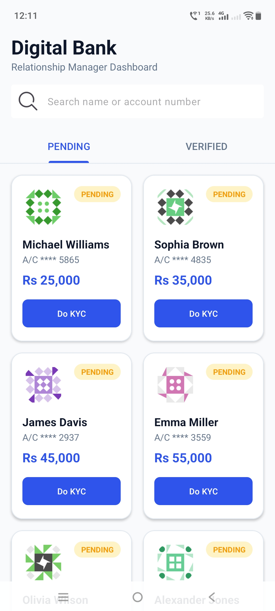
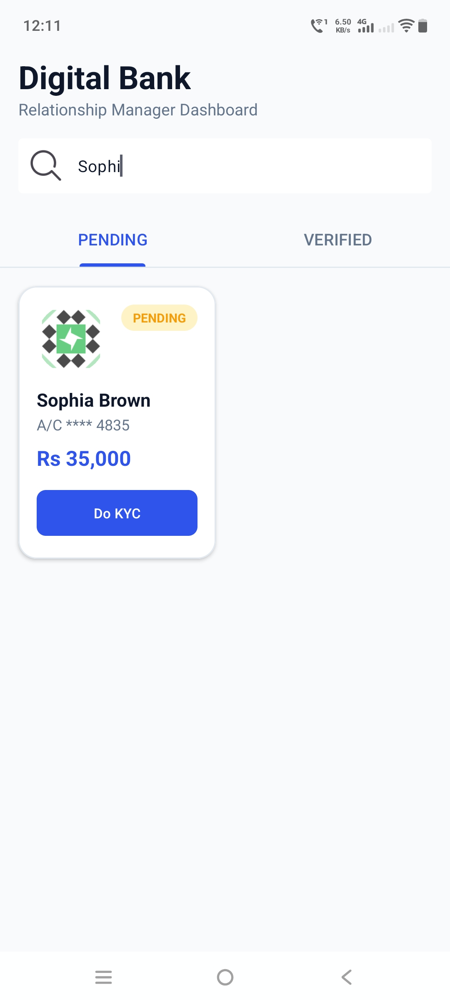
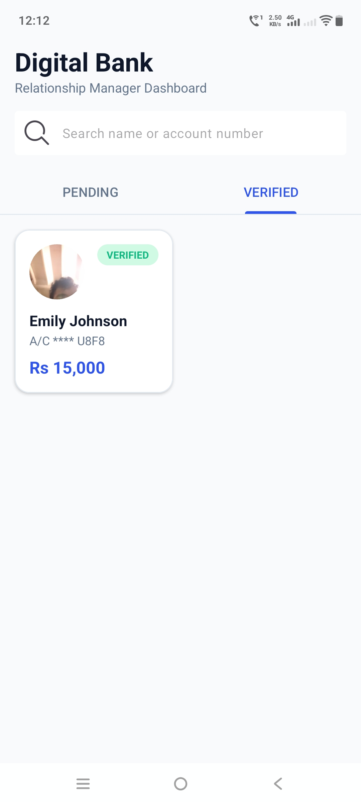

# Digital Banking App - Relationship Manager KYC Dashboard

A premium and robust Android application designed for a digital banking platform. It allows a Relationship Manager (RM) to browse customer accounts, search for customers, view KYC profiles, resolve bank branch details from IFSC codes, and perform in-app KYC verification by capturing selfies using CameraX.

---

## 📸 Visual Walkthrough & Screenshots

### 1. Explore Screen (Pending KYC & Search)


### 2. Explore Screen (Verified KYC)


### 3. In-App CameraX Selfie Capture


### 4. Account Details Screen (Verified KYC)


### 🎬 Full Walkthrough Demo


---

## 🚀 Key Features

1. **Explore Screen (Accounts Tab)**:
   - **Tabbed Layout**: Separates verified and pending customers.
   - **Search Bar**: Real-time filtering by customer name or account number (IBAN).
   - **Grid Cards**: Displaying avatar, name, masked account number, home-currency balance, and KYC status badge.

2. **Product Details Screen**:
   - **Full Profile**: Display of DOB, Nationality, Address, and Contact details.
   - **IFSC Resolver**: Automatically resolves and displays the live Bank and Branch details (e.g., `HDFC Bank, Andheri Branch`) from the customer's IFSC code.
   - **Dynamic KYC Action**: Displays a "Do KYC" trigger for pending users, and shows the captured selfie and a "Re-take Selfie" option for verified users.

3. **In-App Camera Capture (CameraX)**:
   - Built custom camera preview using **CameraX** (avoiding system camera intents or gallery pickers).
   - Dash-oval face guidelines for selfie positioning.
   - Saves the photo directly to internal app storage.

4. **Persistence & Offline Mode**:
   - Offline-first caching with **Room Database**.
   - Preserves captured selfies and verification status (`COMPLETED` / `PENDING`) across app restarts.
   - Seeds data from the remote API only on the first clean launch to prevent overwriting active cache.

---

## 🛠️ Tech Stack & Architecture

- **Language**: Kotlin
- **Architecture**: MVVM (Model-View-ViewModel) with clean separation of UI, Domain, and Data layers.
- **Dependency Injection**: Dagger Hilt
- **Local Database**: Room (Database + DAOs for caching Customers and IFSC details)
- **Networking**: Retrofit (fetching users from DummyJSON and bank branch details from Razorpay IFSC API)
- **Image Loading**: Glide (lazy loading with placeholder fallbacks)
- **Camera engine**: Jetpack CameraX (PreviewView, ImageCapture, and camera lifecycle binding)
- **UI System**: Android View System with Material Design 3, ViewBinding, and ConstraintLayout.

---

## 📦 Project Directory Structure

```
app/src/main/java/com/example/assignment3/
├── MyApplication.kt
├── data/
│   ├── database/       # Room DB, DAOs (CustomerDao, IfscDao)
│   ├── model/          # Entities (Customer, IfscDetails, UserStatus)
│   └── repositories/   # Offline-first repositories (Local & Remote)
├── di/                 # Dagger Hilt Modules (Database, Retrofit qualifiers)
├── network/            # Retrofit API Services (UserApi, IfscApi)
├── ui/                 # View components (MainActivity, Fragments, Adapters)
└── viewmodel/          # ViewModels (UserViewModel, IfscViewModel)
```

---

## ⚙️ How to Build and Run

### Prerequisites
* Android Studio (Koala or newer recommended)
* JDK 17
* Android Device/Emulator with camera support (required for the KYC selfie feature)

### Steps
1. Clone the repository to your local machine.
2. Open the project in Android Studio.
3. Allow Gradle to sync and download all dependencies.
4. Run the project on your device or emulator.
